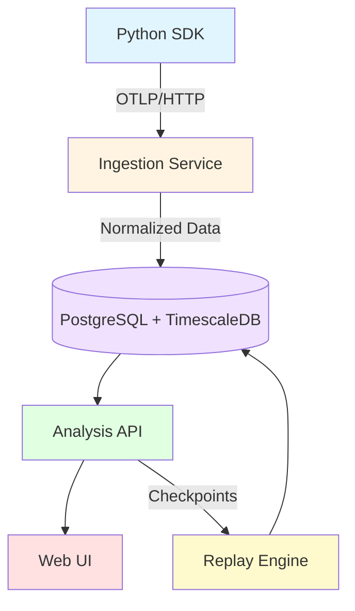

# AgentTrace Architecture

This document provides a comprehensive overview of AgentTrace's system design, component interaction, and data flow.

## System Overview

AgentTrace is built as a modular, microservices-oriented platform for multi-agent LLM debugging and observability. It consists of five main components:



## Component Architecture

### 1. Python SDK (`packages/sdk/python`)

The client library for instrumenting multi-agent applications.

**Responsibilities:**
- Capture agent executions, tool calls, and inter-agent messages
- Export spans via OpenTelemetry Protocol (OTLP)
- Provide decorators for manual instrumentation
- Auto-instrument popular frameworks (LangGraph, AutoGen, CrewAI)

**Key Classes:**
- `AgentTracer` - Main instrumentation API
- `OTLPExporter` - Exports spans to ingestion service
- Framework integrations in `integrations/` directory

**Data Flow:**
```
Your Agent Code
    ↓ (decorators)
AgentTracer.agent() / .tool()
    ↓ (span creation)
OpenTelemetry SDK
    ↓ (batch export)
OTLP HTTP Exporter
    ↓ (HTTP POST)
Ingestion Service :4318
```

### 2. Ingestion Service (`packages/ingestion`)

FastAPI service that receives and normalizes OTLP traces.

**Responsibilities:**
- Accept OTLP traces via HTTP (protobuf and JSON)
- Normalize traces based on agent framework
- Extract agent metadata and inter-agent messages
- Batch write to PostgreSQL with connection pooling

**Key Components:**
- `server.py` - FastAPI application with OTLP endpoint
- `normalizers/` - Framework-specific trace normalization
  - `langgraph.py` - LangGraph state machine detection
  - `autogen.py` - AutoGen conversation extraction
  - `crewai.py` - CrewAI crew coordination
  - `generic.py` - Fallback for custom agents
- `writer.py` - Batch database writer

**Normalization Pipeline:**
```
OTLP Trace
    ↓
Detect Framework
    ↓
Framework Normalizer
    ├─ Extract agent names/roles
    ├─ Identify inter-agent messages
    ├─ Detect tool calls
    └─ Classify span types
    ↓
Database Writer
    ├─ traces table
    ├─ spans table (hypertable)
    ├─ agents table
    └─ agent_messages table
```

### 3. Core Models (`packages/core`)

Shared data structures used across all services.

**Responsibilities:**
- Define Pydantic models for validation
- Provide SQLAlchemy ORM models for database
- Manage configuration and environment variables
- Define custom exceptions

**Key Models:**

| Model | Description | Database Table |
|-------|-------------|----------------|
| `Trace` | Top-level workflow execution | `traces` |
| `Span` | Individual unit of work | `spans` |
| `Agent` | Agent metadata | `agents` |
| `AgentMessage` | Inter-agent communication | `agent_messages` |
| `Checkpoint` | State snapshot for replay | `checkpoints` |
| `FailureAnnotation` | MAST taxonomy classification | `failure_annotations` |

### 4. Analysis Engine (`packages/analysis`)

Processes traces to build graphs and classify failures.

**Responsibilities:**
- Construct agent communication graphs
- Classify failures using MAST taxonomy
- Provide REST API for querying and analysis
- Aggregate metrics across traces

**Key Components:**
- `graph.py` - Agent graph construction and algorithms
- `mast/classifier.py` - Rule-based failure classification
- `api.py` - FastAPI router with 8+ endpoints
- `metrics.py` - Aggregation and statistics

**Graph Construction Algorithm:**
```python
def build_agent_graph(trace_id):
    # 1. Query agent_messages for trace
    messages = db.query(AgentMessageModel).filter_by(trace_id=trace_id)

    # 2. Build nodes (unique agents)
    agents = set((msg.from_agent, msg.to_agent) for msg in messages)
    nodes = [create_node(agent) for agent in agents]

    # 3. Build edges (message aggregation)
    edges = aggregate_messages(messages)

    # 4. Calculate graph metrics
    centrality = calculate_centrality(nodes, edges)

    return {"nodes": nodes, "edges": edges, "metrics": centrality}
```

**MAST Classification Rules:**
```python
# Example rule for reasoning failures
if span.status == "error" and "plan" in span.name.lower():
    if "invalid" in error_message or "incomplete" in error_message:
        return FailureAnnotation(
            category="reasoning",
            subcategory="planning_error",
            severity="high"
        )
```

### 5. Replay Engine (`packages/replay`)

Enables time-travel debugging with checkpoints.

**Responsibilities:**
- Create checkpoints at key execution points
- Restore agent state from checkpoints
- Re-execute from checkpoint with modified inputs
- Generate diffs between original and replay outputs

**Key Components:**
- `checkpoint.py` - Checkpoint creation and management
- `executor.py` - Replay execution logic
- `differ.py` - Output comparison
- `executors/` - Framework-specific executors

**Replay Workflow:**
```
1. Create Checkpoint
   - Save span state at key point
   - Store input, context, configuration

2. User Requests Replay
   - Select checkpoint
   - Optionally modify input

3. Restore State
   - Load checkpoint data
   - Reconstruct agent context

4. Re-execute
   - Run agent from checkpoint
   - Use mock or real executor

5. Generate Diff
   - Compare original vs. replay output
   - Highlight changes
```

### 6. Web UI (`web/`)

React-based dashboard for trace visualization.

**Responsibilities:**
- Display trace list with filtering
- Render agent communication graphs (D3.js)
- Show span timeline (Gantt chart)
- Display failure annotations
- Provide replay controls

**Key Technologies:**
- React 18 + TypeScript
- Vite for build tooling
- Tailwind CSS for styling
- React Query for data fetching
- D3.js for graph visualization
- React Router for navigation

**Component Structure:**
```
src/
├── api/
│   ├── client.ts           # Axios API client
│   └── types.ts            # TypeScript interfaces
├── hooks/
│   ├── useTraces.ts        # Trace data fetching
│   ├── useGraph.ts         # Graph data fetching
│   └── useCheckpoints.ts   # Checkpoint management
├── components/
│   ├── TraceList/          # Paginated list + filters
│   ├── AgentGraph/         # D3.js force-directed graph
│   ├── SpanTimeline/       # Gantt-style timeline
│   ├── FailurePanel/       # MAST taxonomy display
│   └── ReplayControls/     # Checkpoint + replay UI
└── pages/
    ├── TracesPage.tsx      # Main trace list
    └── TraceDetailPage.tsx # Detail view
```

## Database Schema

AgentTrace uses PostgreSQL 16 with TimescaleDB extension.

### Schema Diagram

```
┌─────────────────┐
│     traces      │
│─────────────────│
│ trace_id (PK)   │◄──────┐
│ name            │       │
│ start_time      │       │
│ end_time        │       │
│ service_name    │       │
│ metadata        │       │
└─────────────────┘       │
                          │
┌─────────────────┐       │
│     spans       │       │
│─────────────────│       │
│ span_id (PK)    │       │
│ trace_id (FK)   ├───────┘
│ parent_span_id  │
│ name            │
│ start_time      │◄─── Hypertable
│ end_time        │     (partitioned)
│ attributes      │
│ events          │
│ status          │
└─────────────────┘
        │
        │
        ▼
┌─────────────────┐
│ agent_messages  │
│─────────────────│
│ message_id (PK) │
│ trace_id (FK)   │
│ from_agent      │
│ to_agent        │
│ message_type    │
│ content         │
└─────────────────┘
```

### Table Descriptions

**traces** - Top-level trace metadata
- Primary key: `trace_id` (UUID)
- Indexes: `start_time`, `service_name`, `status`

**spans** - Individual execution units (TimescaleDB hypertable)
- Primary key: `span_id` (UUID)
- Foreign key: `trace_id` → traces
- Partitioned by: `start_time` (1-day chunks)
- Indexes: `trace_id`, `parent_span_id`, `start_time`

**agents** - Agent metadata
- Primary key: `agent_id` (UUID)
- Unique: `(name, framework, trace_id)`

**agent_messages** - Inter-agent communication
- Primary key: `message_id` (UUID)
- Foreign key: `trace_id` → traces
- Indexes: `trace_id`, `from_agent`, `to_agent`

**checkpoints** - State snapshots for replay
- Primary key: `checkpoint_id` (UUID)
- Foreign key: `span_id` → spans
- Contains: serialized state, input, configuration

**failure_annotations** - MAST taxonomy classifications
- Primary key: `annotation_id` (UUID)
- Foreign keys: `trace_id` → traces, `span_id` → spans
- Indexes: `category`, `severity`, `trace_id`

### Migrations

Database migrations are managed with Alembic:

```bash
# View migration history
uv run alembic history

# Apply migrations
uv run alembic upgrade head

# Create new migration
uv run alembic revision -m "description"
```

## Data Flow

### Trace Ingestion Flow

```
1. Agent Application
   ↓
   @tracer.agent() decorator called
   ↓
2. AgentTracer (SDK)
   ↓
   Creates OpenTelemetry span
   ↓
3. OTLP Exporter
   ↓
   Batches spans (default: 512)
   ↓
   HTTP POST to :4318/v1/traces
   ↓
4. Ingestion Service
   ↓
   Parses OTLP format
   ↓
   Detects framework (LangGraph/AutoGen/etc)
   ↓
   Normalizes attributes
   ↓
   Extracts agents and messages
   ↓
5. Database Writer
   ↓
   Batch insert (default: 100 spans)
   ↓
   Connection pooling (default: 20 connections)
   ↓
6. PostgreSQL + TimescaleDB
   ↓
   Data stored in hypertables
```

### Query and Visualization Flow

```
1. User Opens Web UI
   ↓
2. React Query Hook
   ↓
   GET /api/traces?offset=0&limit=50
   ↓
3. Analysis API
   ↓
   Query traces table
   ↓
   Return paginated results
   ↓
4. Web UI Renders List
   ↓
5. User Clicks Trace
   ↓
   GET /api/traces/{id}/graph
   ↓
6. Analysis Engine
   ↓
   Query agent_messages
   ↓
   Build graph structure
   ↓
   Calculate metrics
   ↓
7. Web UI Renders D3.js Graph
```

## Performance Considerations

### Ingestion Throughput

**Bottleneck: Database writes**

Optimizations:
- Batch insertion (100 spans per batch)
- Connection pooling (20 connections + 10 overflow)
- TimescaleDB hypertables for time-series data
- Async database operations

**Throughput:** ~10,000 spans/second (single instance)

### Query Performance

**Bottleneck: Complex graph queries**

Optimizations:
- Indexes on common query patterns
- TimescaleDB time-based partitioning
- Query result caching (future)
- Pre-computed graph structures (future)

### Scalability

**Horizontal Scaling:**
- Ingestion service: Stateless, can run multiple instances behind load balancer
- Analysis API: Stateless, can run multiple instances
- Database: Single PostgreSQL instance (can be scaled with read replicas)

**Vertical Scaling:**
- Increase database resources for more storage and query speed
- Increase ingestion workers for higher throughput

## Security Considerations

### Data Privacy

- Traces may contain sensitive information (user inputs, API keys)
- Consider encryption at rest for production deployments
- Implement access controls on API endpoints (future feature)

### Network Security

- Use HTTPS for production deployments
- Consider VPN or private network for ingestion endpoint
- Implement authentication on API endpoints (future feature)

### Input Validation

- OTLP traces are validated against schema
- Malformed traces are rejected with 400 error
- SQL injection prevented by ORM usage

## Monitoring and Observability

### Metrics Exposed

- `agenttrace_traces_received_total` - Total traces ingested
- `agenttrace_spans_received_total` - Total spans ingested
- `agenttrace_ingestion_errors_total` - Ingestion errors
- `agenttrace_ingestion_duration_seconds` - Ingestion latency

### Health Checks

- Ingestion service: `GET /health`
- Analysis API: `GET /health`
- Database: Connection pooling health monitoring

### Logging

- Structured logging with Python `logging` module
- Log levels: DEBUG, INFO, WARNING, ERROR
- Configure via `LOG_LEVEL` environment variable

## Future Architecture Enhancements

### Planned Features

1. **Multi-tenancy** - Support multiple organizations/users
2. **Authentication & Authorization** - OAuth2/OIDC integration
3. **Real-time Streaming** - WebSocket for live trace updates
4. **Distributed Tracing** - Support for distributed multi-agent systems
5. **Advanced Replay** - Full framework-specific replay executors
6. **Alerting** - Configurable alerts on failure patterns
7. **Export** - Export traces to other formats (Zipkin, Jaeger)

### Scalability Roadmap

1. **Phase 1** (Current) - Single instance, up to 10k spans/sec
2. **Phase 2** - Horizontal scaling with load balancer
3. **Phase 3** - Read replicas for query performance
4. **Phase 4** - Distributed ingestion with message queue
5. **Phase 5** - Multi-region deployment

## Related Documentation

- [Getting Started Guide](getting-started.md) - Setup and first steps
- [API Reference](api-reference.md) - REST API documentation
- [SDK Guide](sdk-guide.md) - Python SDK usage
- [Deployment Guide](deployment.md) - Production deployment

## Contributing to Architecture

When proposing architectural changes:

1. Review existing design patterns
2. Consider backward compatibility
3. Document performance impact
4. Update this document
5. Discuss in GitHub issues before major changes
